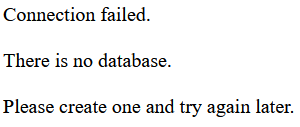
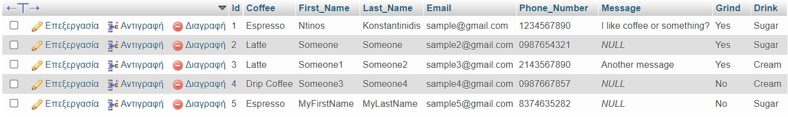
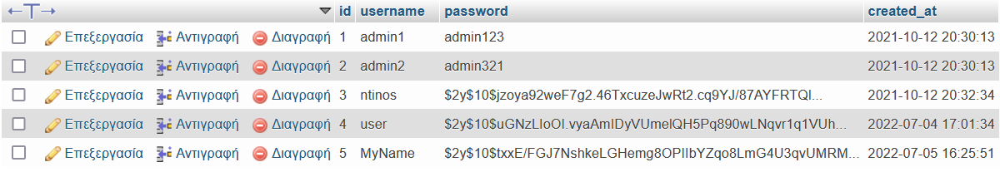

# Introduction
There are 2 main pages:
- A fully secure admin page where you can:
  - Create a database
  - Display all the database records
  - Search for specific records in the database
- A fully secure and functional contact us page with the option:
  - To fill in and submit a form

Please <a href="https://github.com/K-Konstantinidis/Fully-Secure-Contact-Us-Page/blob/master/READ%20ME.txt" target="_blank">read me</a> to avoid possible errors.
# Table of Contents
1. [Download XAMPP](#Download-XAMPP)
2. [Admin Page](#Admin-Page)
3. [Contact Us Page](#Contact-Us-Page)
4. [LogIn - SignUp - Reset](#LogIn---SignUp---Reset)

# Download XAMPP


###### What is Xampp
```
Xampp is a free and open-source cross-platform web server solution stack package developed by Apache Friends,consisting mainly of the Apache HTTP Server, 
MariaDB database, and interpreters for scripts written in the PHP and Perl programming languages.
```
[Learn More About Xampp](https://en.wikipedia.org/wiki/XAMPP)

[Download xampp](https://www.apachefriends.org/download.html) to try both the form and the admin page.

Here is a [guide](https://www.ionos.com/digitalguide/server/tools/xampp-tutorial-create-your-own-local-test-server/) on how to download, install and set up XAMPP.

# Admin Page

## Admin Index


## Create Database
Just **_click_** the button to create the database.


  
If there is not a database, the admin cannot search for database records.



## Display All Database Records
`The admin can see all the records in the database`




## Search Specific Database Records
`The admin can search for specific records in the database`

 

# Contact Us Page
## User Index
`The contact us form`


## Submit
`Successful Submit`


`Empty fields`


`ERROR: Admin did not create a database`


# LogIn - SignUp - Reset
## LogIn


## SignUp


## Reset Password


## Users
`In the database you can see that every single user (except the admins) have a hash password`


